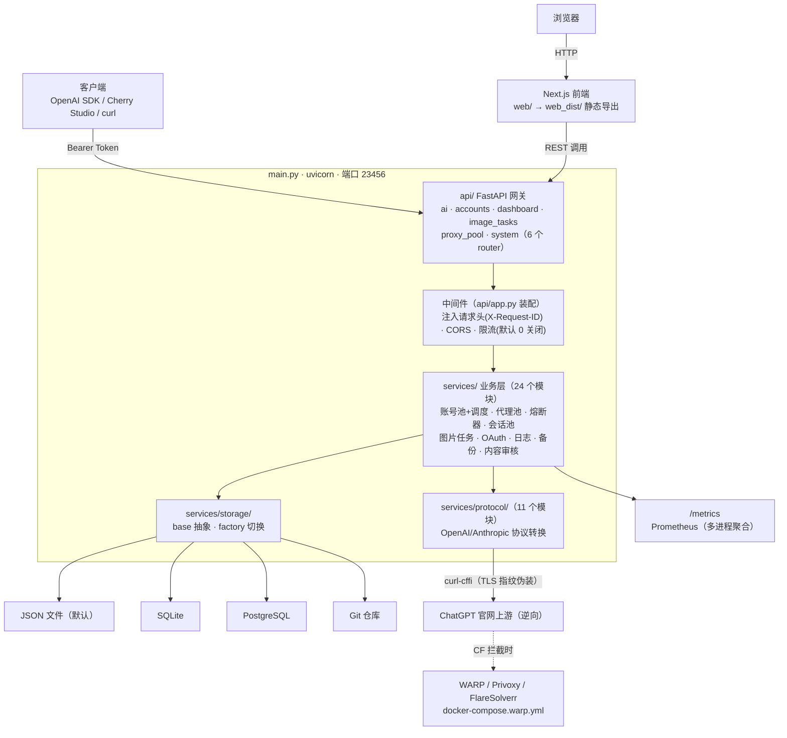

# 01 · 架构总览

## 系统边界

ChatGPT2API 是一个**单体 FastAPI 服务 + Next.js 静态导出前端**，对内管理账号池/代理池/调度，对外扮演 OpenAI 兼容网关。无外部队列、无独立缓存层——状态全部收敛在存储层（JSON/SQLite/PostgreSQL/Git 四选一），这是理解整个系统的关键。

## 分层职责

| 层 | 目录 | 职责 | 改动风险 |
|----|------|------|---------|
| 网关层 | `api/`（15 个文件） | 路由、入参校验、限流/安全/metrics 中间件 | 新增端点低风险；动中间件装配顺序高危 |
| 业务层 | `services/`（25 个模块） | 调度算法、熔断、任务编排、OAuth、代理池 | 调度/熔断逻辑高危（有单测守护） |
| 协议层 | `services/protocol/`（12 个模块） | OpenAI/Anthropic 请求响应转换、SSE 流 | 前后端契约源头，改字段必跑双验证 |
| 存储层 | `services/storage/`（5 个文件） | base 抽象（6 个方法）+ factory + 4 后端 | 改 base 接口 = 4 个后端全量回归 |
| 前端 | `web/src/`（77 个文件） | 看板/账号/图片/设置等 8 个页面 | 安全区，但字段名与 protocol/ 绑定 |
| 共享工具 | `utils/`（8 个文件） | pkce / pow / sentinel / turnstile / token 计算 | 上游逆向基础设施，基本只读 |

## 关键数据流

**图片生成请求（主链路）**：

`api/ai.py:/v1/images/generations` 收单 → `account_service.py` 调度（`_account_health_tier` 分 healthy/warm/risky 三档 → `_account_dispatch_score` 算调度分 → 按 `scheduler_mode` 选择）→ `circuit_breaker.py` 检查上游健康（连续失败 5 次熔断，30s 半开）→ `session_pool.py` 复用 TLS 会话（按代理配置缓存）→ `protocol/openai_v1_image_generations.py` 组包 → curl-cffi 发上游 → `content_filter.py` 审核 → `image_task_service.py` 落任务 → 可选 `image_storage_service.py` 持久化图片。

**多模态协议面**：同一套调度/熔断/会话复用支撑 `/v1/chat/completions`、`/v1/responses`、`/v1/messages`（Anthropic 协议，`protocol/anthropic_v1_messages.py` 转换）、`/v1/search`、`/v1/ppt/generations`、`/v1/psd/generations`。

**管理面**：`accounts.py`（账号 CRUD + OAuth 登录 + 刷新 + CPA 池）、`dashboard.py`（调度/资源/用量/延迟 4 个 API + `/metrics` + SSE `/api/dashboard/stream` 3s 推送）、`proxy_pool.py`（代理 CRUD + 权重调度 + 健康检查）、`system.py`（登录/设置/图片/日志/备份/存储信息）。

**多 Worker 指标**：`workers > 1` 时 `main.py` 初始化 `PROMETHEUS_MULTIPROC_DIR`（`data/prometheus_multiproc/`，启动时清空 `*.db`），各进程写指标文件，`/metrics` 端点聚合输出。

## 安全模型与威胁边界

| 边界 | 机制 | 位置 |
|------|------|------|
| API 认证 | Bearer Token（auth-key），production 下 <12 位拒绝启动 | `services/auth_service.py`、`services/config.py` |
| 密钥管理 | 环境变量覆盖 config.json（`CHATGPT2API_AUTH_KEY` 等），config.json 不进容器镜像而是挂载 | `services/config.py:362` |
| 注入面 | 无 SQL 拼接（SQLAlchemy ORM）；存储层统一走 `storage/base.py` | `services/storage/` |
| 限流 | 全局 RPM + 单 IP RPM 滑动窗口（默认 0 关闭） | `api/rate_limit.py`（`api/app.py` 已接线，S-R15） |
| 请求大小 | 已移除（`request_size_limit` 中间件与 `max_request_body_mb_*` 死配置已一并清理） | 无 |
| 安全头 | 已移除（`api/security_headers.py` 已删除；企业内网自用，安全由调用方处理） | 无 |
| SSRF 防护 | 图片 URL 抓取前校验协议白名单 + 内网 IP 段（`CHATGPT2API_SSRF_ALLOW_PRIVATE_IPS` 可回退，默认拒绝内网） | `services/ssrf_guard.py`（`api/image_inputs.py:261` 消费） |
| 备份 | OpenSSL 加密 + HMAC；用户配置入口为 config.json 的 `backup.passphrase`（环境变量仅为内部子进程传参） | `services/backup_service.py` |
| 日志脱敏 | URL/邮箱/会话 ID 采集与内部字段剥离 | `services/log_service.py` |
| 逆向合规 | README 免责声明不可删；不用于商业/批量/滥用 | 项目红线 |

## 扩展极限与容量

- **压测基线**：7912 req/min（N5 节点验收，多 Worker + 限流配置下）。
- **多 Worker 约束**：`workers > 1` 要求 SQLite/Postgres 后端；JSON 后端 main.py 强制回退 workers=1（防多进程各持账号副本导致重复分配/数据丢失）。多进程共享状态只走存储层，**禁止模块级可变全局变量跨请求持有**。
- **账号池上限**：无硬编码上限；调度分为 O(n) 逐账号计算，账号数千级以内无感知。
- **日志**：超 5000 条惰性裁剪到 3000 条（N11），防高频 I/O。
- **SSE**：`/api/dashboard/stream` 3s 推送周期；客户端断开靠 `CancelledError` 退出（历史 P1 修复点）。

## 技术债与已知边界（诚实清单）

| 项 | 现状 | 计划 |
|----|------|------|
| ruff / mypy | CI 中 `continue-on-error: true`，存量逐步清零（已修 180 处） | 清零后移除 continue-on-error；新代码必须自身干净 |
| pip-audit | 同上，高危漏洞提示不阻断 | 同上 |
| 测试标记 | live/redis/unit 靠 `-m` 区分而非目录隔离（项目约定，有意为之） | 维持 |
| pytest 模块缓存竞态 | 4 个 image_tasks_api 测试全量跑偶发失败，单独跑全过 | 已知，低风险 |
| graft 索引 | `graft/` 已索引本仓库；改完代码跑 `graft build` 刷新 | 维持 |
| mypy 严格度 | `warn_unused_ignores = false` 等宽松配置 | 逐步收紧 |

## 架构决策记录

- `docs/adr/index.md` — ADR 索引（重大选型：端口固定、存储抽象、多 Worker 回退、测试标记约定等）
- `docs/upstream-sse-conversation.md` — 上游 SSE 会话研究报告（逆向细节）
- `docs/PLAN.md` + `计划书/` — 原始需求与执行记录
